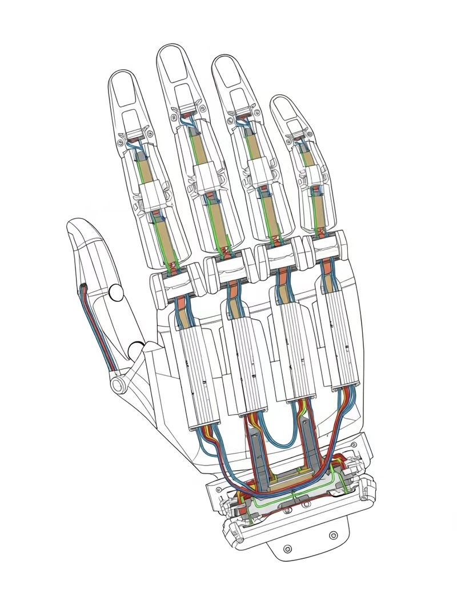
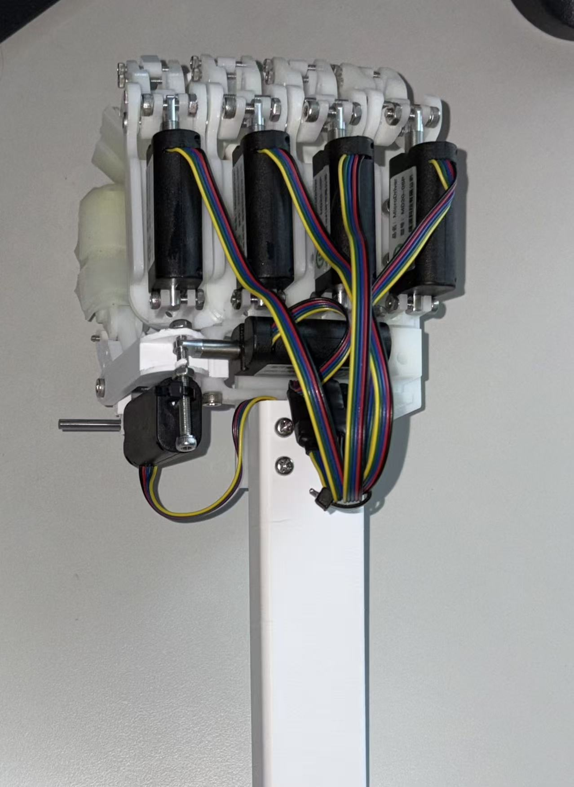

# Dexterous Hand Control System for Precision Grasping

A robotics project focused on **precision grasping**, **embedded control**, and **hardware-software integration** using an Arduino-based dexterous hand prototype.

This project presents a dexterous hand control system designed to improve grasp stability for objects of different sizes through a staged control strategy. The system combines a **pinch-first grasping mechanism**, **position-synchronized follower fingers**, and a **fine adjustment mode** for small-object manipulation.

The thumb and index finger are driven by **LV-TTL motors** to perform the primary pinch action, while the remaining three fingers are driven by **PWM servos** to provide follow-up wrapping support. To improve reliability and reduce latency during prototyping, a **button-based control interface** was adopted instead of Bluetooth communication.

---

## Project Highlights

- **Pinch-first grasping strategy** for initial object capture
- **Load-threshold stop logic** for safer and more stable contact
- **Position-synchronized follower fingers** for coordinated wrapping
- **Fine adjustment mode** for small-object grasping
- **Low-latency button-based control** for reliable prototyping
- **Integrated embedded control and robotic hardware implementation**

---

## Motivation

Dexterous robotic grasping requires both precise initial contact and stable follow-up wrapping. In low-cost prototypes, simple open-loop control often leads to unstable grasps, delayed response, or poor performance on small targets.


This project explores a lightweight and practical control solution that balances:

1. **stable initial pinch contact**,
2. **coordinated finger wrapping**,
3. **limited fine adjustment for small or difficult objects**.

The goal was not only to make the hand move, but to design a control strategy that is **interpretable**, **tunable**, and **effective in real hardware tests**.

---

## System Overview

The system is built around an **Arduino controller** and consists of two main actuation groups:

- **Pinch fingers:** thumb and index finger driven by LV-TTL motors for initial object capture
- **Follower fingers:** three PWM-driven fingers for synchronized wrapping after pinch contact

The system uses a **button-based interface** to trigger grasping, opening, and fine adjustment actions. This design was chosen to reduce control latency and improve repeatability during hardware testing.

### Hardware Components

- Arduino Mega2560 (or Mega2560 Pro)
- 2 × LV-TTL motors (pinch fingers)
- 3 × PWM servos (follower fingers)
- push buttons for interaction
- power supply and wiring interface

---


## From Concept to Prototype

<table>
  <tr>
    <td align="center"><b>Concept Design</b></td>
    <td align="center"><b>Physical Prototype</b></td>
  </tr>
  <tr>
    <td></td>
    <td></td>
  </tr>
</table>

This comparison shows the transition from the early structural concept to the implemented hardware prototype.  
The final system preserves the overall back-side actuator layout and finger arrangement while adapting the design for practical assembly, wiring, and embedded control integration.

---

## Control Strategy

The control logic consists of four main stages.

### 1. Open State
The hand remains open and ready for a new grasp.

### 2. Pinch Phase
The thumb and index finger move toward each other until contact is detected through a **load-threshold condition**.

### 3. Wrap Phase
After pinch contact, the remaining three fingers move according to a **position-synchronized mapping strategy**, improving overall grasp stability.

### 4. Fine Adjustment Phase
For small or difficult objects, an additional **fine adjustment step** is used to slightly refine finger position and improve grasp success.

This staged strategy separates **initial capture** from **grasp stabilization**, making the system easier to tune and analyze during testing.

---

## Design Trade-off: Buttons vs Bluetooth

Although Bluetooth control offers greater flexibility, it introduced additional latency and reduced repeatability during early-stage hardware testing. Since this project focused on **grasp reliability** and **rapid prototyping**, a button-based interface was chosen as a more stable and lower-latency solution.

This reflects an important engineering trade-off:

- sacrificing some communication convenience,
- in order to improve robustness and repeatability during prototype validation.

---

## Wiring and Pin Map

| Module | Connection |
|---|---|
| LV-TTL Motor 1 | Thumb / pinch finger |
| LV-TTL Motor 2 | Index / pinch finger |
| PWM Servo 1 | Follower finger 1 |
| PWM Servo 2 | Follower finger 2 |
| PWM Servo 3 | Follower finger 3 |
| Button A (GRIP) | Grasp trigger |
| Button B (OPEN) | Open / release |
| Button C & D | Fine adjustment for thumb |
| Button E & F | Fine adjustment for index |
| Button G (STOP) | Emergency stop |
| Button H (SYNC) | Synchronized follower fingers |

This table is the hardware role mapping. For exact firmware pin/interface mapping (and to keep README consistent with firmware), see [`docs/wiring.md`](docs/wiring.md).

---

## Key Parameters

The system behavior is mainly affected by the following parameters:

- **motion limits** for pinch fingers
- **load threshold** for contact detection
- **position mapping** between pinch motor and follower fingers
- **fine adjustment step size**
- **initial open position calibration**

A complete calibration and tuning guide is maintained in [`docs/calibration.md`](docs/calibration.md).

---

## Experimental Results

The prototype was tested on objects of different sizes and manipulation tasks. A concise quantitative summary is shown below.

### Quantitative Summary

| Task | Trials | Success | Success Rate |
|---|---:|---:|---:|
| Ping-pong ball grasp | 30 | 30 | 100.0% |
| Rubik's cube grasp | 30 | 30 | 100.0% |
| Water bottle (half full) grasp | 30 | 26 | 86.7% |
| Thumbtack grasp (fine adjust) | 30 | 11 | 36.7% |
| Card pick & insertion | 50 | 46 | 92.0% |
| Bottle cap loosening | 50 | 19 | 38.0% |

### Main Observations

- medium and large objects could be grasped with high stability,
- small objects were more sensitive to alignment and finger position,
- the fine adjustment mode improved grasp feasibility for small targets,
- synchronized follower fingers improved wrapping support after the initial pinch.

For full logs and notes, see [`results/grasp_tests.csv`](results/grasp_tests.csv) and [`results/grasp_summary.md`](results/grasp_summary.md).

---

## Limitations and Future Work

While the current prototype demonstrates stable grasping for medium and large objects, several limitations remain:

- small, thin, or low-friction objects are still difficult to grasp reliably,
- the current system relies on threshold-based contact handling rather than richer tactile sensing,
- follower fingers improve grasp wrapping but do not yet adapt independently to object geometry,
- the overall control strategy is still relatively simple and does not include full closed-loop grasp optimization.

Possible future improvements include:

- grasp success rate comparison across object categories,
- ablation study (pinch only vs pinch + sync vs pinch + sync + fine adjust),
- response time measurement for contact stop and adjustment,
- failure case analysis for small, thin, and low-friction objects,
- adding tactile or force sensing,
- improving closed-loop coordination across all fingers,
- introducing object-specific grasp planning.

---

## Repository Structure

```text
dexterous-hand-md20/
├── docs/           # design notes, calibration, wiring
├── firmware/       # Arduino control code
├── hardware/       # wiring, BOM, hardware-related files
├── media/          # demo videos and images
├── results/        # grasp logs, summaries, test outputs
└── README.md
```

## How to Run

1. Install **Arduino IDE** (recommended 2.x series, e.g. 2.3+).
2. Install required dependency library:
   - `Servo.h` (Arduino Servo library).
3. Open firmware:
   - `firmware/arduino/code/dexterous_hand_controller.ino`.
4. Configure board and serial settings:
   - Board: **Arduino Mega or Mega 2560**,
   - Port: the COM/TTY port connected to your controller,
   - Serial Monitor baud rate: **115200**.
5. Connect motors, servos, and buttons according to [`docs/wiring.md`](docs/wiring.md).
6. Upload firmware, power the system, verify initial open position, and test GRIP/OPEN/SYNC/FINE functions.
7. Tune parameters following [`docs/calibration.md`](docs/calibration.md) if needed.

---

## Media

- Demo GIF: [`media/gifs/demo.gif`](media/gifs/demo.gif)
- Video list and top demonstrations: [`media/videos.md`](media/videos.md)

---

## About the Author

This project reflects my interest in robotic manipulation, embedded control, and hardware-software integration. I focused on control architecture, embedded implementation, hardware-software integration, and iterative grasp testing.

Kaiyang Deng  
Robotics Engineering, South China University of Technology  
GitHub: KaiSANG121
